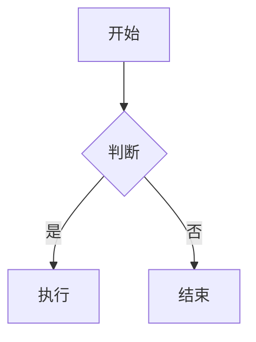

## 什么是 Markdown

Markdown 是一种轻量级标记语言，用纯文本就能写出格式丰富的文档。这篇文章涵盖了所有常用语法。

## 标题

在文字前加 `#` 号，`#` 越多标题层级越低：

```markdown
# 一级标题
## 二级标题
### 三级标题
#### 四级标题
```

## 文字样式

| 语法 | 效果 |
|------|------|
| `**粗体**` | **粗体** |
| `*斜体*` | *斜体* |
| `***粗斜体***` | ***粗斜体*** |
| `~~删除线~~` | ~~删除线~~ |
| `` `行内代码` `` | `行内代码` |

## 链接与图片

```markdown
[链接文字](https://example.com)


```

链接可以加上标题（鼠标悬停显示）：

```markdown
[GitHub](https://github.com "点击访问 GitHub")
```

## 列表

无序列表用 `-`、`*` 或 `+`：

```markdown
- 项目一
- 项目二
  - 子项目
  - 子项目
```

有序列表用数字加点：

```markdown
1. 第一步
2. 第二步
3. 第三步
```

## 引用

在文字前加 `>`：

> 这是一段引用。
>
> 引用可以多行，也可以包含其他 Markdown 元素。

多层引用用 `>>`：

> 第一层
>>
>> 第二层

## 代码块

用三个反引号包裹，后面写语言名会有语法高亮：

```javascript
function hello() {
  console.log("Hello, World!");
}
```

```python
def greet(name):
    return f"你好，{name}"
```

## 分割线

三个或以上的 `---`：

---

## 表格

```markdown
| 左对齐 | 居中 | 右对齐 |
|:-------|:----:|-------:|
| 内容   | 内容 | 内容   |
| 更长内容 | 内容 | 内容 |
```

效果：

| 左对齐 | 居中 | 右对齐 |
|:-------|:----:|-------:|
| 内容 | 内容 | 内容 |
| 更长内容 | 内容 | 内容 |

## 任务列表

```markdown
- [x] 已完成任务
- [ ] 未完成任务
- [ ] 待办事项
```

效果：
- [x] 已完成任务
- [ ] 未完成任务
- [ ] 待办事项

## 脚注

```markdown
这是一段带脚注的文字[^1]。

[^1]: 这是脚注内容。
```

## 数学公式（KaTeX）

行内公式用 `$` 包裹：$E = mc^2$

块级公式用 `$$` 包裹：

$$
\int_0^\infty e^{-x^2} dx = \frac{\sqrt{\pi}}{2}
$$

## Mermaid 图表



## 提示框

本主题支持多种提示框，用 `:::` 包裹：

:::note
这是一条普通提示。
:::

:::tip
这是一条技巧提示。
:::

:::warning
这是一条警告。
:::

:::caution
这是一条注意事项。
:::

## HTML 混用

Markdown 里可以直接写 HTML，比如折叠面板：

<details>
<summary>点击展开</summary>

这里是被隐藏的内容，可以放更多信息。

- 参考链接一
- 参考链接二

</details>

## 总结

以上就是 Markdown 的常用语法。写博客用这些完全够了。平时边写边查，慢慢就记住了。
